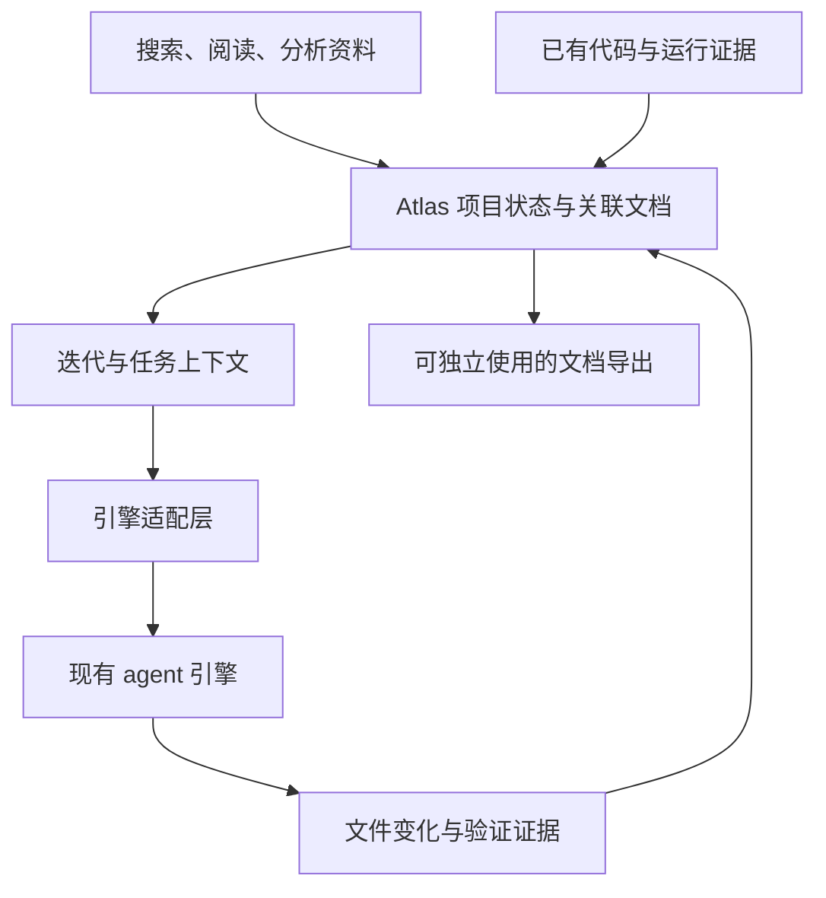

# U17 — Atlas 项目设计与持续开发工作台

日期：2026-09-13  
状态：产品方向已确认；M0–M4 与核心主线最小真实开发冒烟已完成；继续推进 M5 评估型完整试点。
配套：[开发规划](U17_DEVELOPMENT_PLAN.md) · [M5 试点计划](U17_M5_PILOT_PLAN.md) · [路线图](../USAGE_ROADMAP.md)

## 1. 定位与已确认方向

U17 帮助用户从现有类型和应用知识出发，阅读、分析、形成开发文档，并围绕同一个项目持续改进。

已确认的方向：

1. 新想法先搜索类型和应用，再阅读、比较资料，基于资料生成产品与开发文档；允许在分析中反复搜索。
2. 已有项目改进属于首版范围，也覆盖经 U17 开发后需要继续修改的项目。
3. “是否值得做”提供事实、信息和建议，由用户决定；不构成自动终止或转向购买产品的条件。
4. Atlas 自建项目编排与知识管理能力，短期以 OpenCode 为首个可替换的执行后端；长期可继续复用，不预设必须淘汰或全部自研。
5. 项目知识、决策、文档、迭代与验收状态由 Atlas 独立持久化；文档可导出，项目可在外部开发后重新接入。引擎会话丢失时，仍能核对项目状态并交接下一项任务。
6. 是否扩大底层 harness 的自研范围，由真实任务中的行为控制、部署限制及可衡量的效果与成本决定；首版不从模型 API 开始重写通用 coding agent。

本文提出的首版默认值：沿用本地工作台形态，先接入一个执行引擎；优先验证 OpenCode。具体接口、持久化格式及页面布局由原型验证，不视为已经落地的技术结论。

成功的结果是：用户能解释本版为什么这样设计，开发者能据此开展工作，下一轮改进能利用实际开发结果。

## 2. 当前基础与缺口

以下是 2026-09-13 的代码检查结果，不代表 U17 已具备相应完整能力。

| 能力 | 当前基础 | U17 需要补齐 |
|---|---|---|
| 类型与应用知识 | 1,805 个正式类型、对应研究笔记及 33 个应用目录实例；项目可固定摘录和来源版本 | 扩充应用深度资料，并让自动分析只使用项目已固定的依据 |
| 搜索 | 网页统一搜索类型与应用；MCP 提供类型向量搜索及分类 | 在分析过程继续搜索并记录采用或排除理由；分类仅作建议 |
| 阅读 | 类型正文和研究笔记可按全文或章节阅读、收藏；应用目录级资料明确标注深度 | 增加应用深度来源，继续保留完整性和语言说明 |
| Agent | OpenCode 适配器核心链路和 Atlas 状态投影已验证 | 将文档任务与正式开发任务接入项目编排、工作区和验收记录 |
| 项目与文档 | 项目资料集、需求/确认、决定、依赖化文档集合、章节级自然语言修改、可选价值分析、不可变版本、依赖复核、独立导出、工作区基线、外部变化检查、目标驱动改进、结构化任务和持续执行已实现 | 完整试点 |

依据：[README](../README.md)、[搜索页面](../atlas-web/src/routes/search.tsx)、[应用数据结构](../atlas-web/src/lib/atlas.ts)、[MCP](../application-atlas-production-pack/mcp_atlas.py)、[草稿引擎](../application-atlas-production-pack/drafts_engines/__init__.py)。

资料使用的实际限制：

- 应用实例当前主要包含名称、简介、任务和类型关联，不能把每个实例都当成已有完整页面与流程拆解。
- 现有 MCP `get_leaf` 对多个字段做长度截断，也不返回完整研究笔记。生成文档前需支持按章节或分页读取全文，明确告知读取是否完整。
- 部分研究笔记包含边界内容，但结构化导出遗漏了嵌套章节。不能用字段为空推断“不存在边界问题”。
- 中文内容可能不完整；引用保留原文入口和语言。正式类型文档也不直接提供具体项目的技术架构。
- 分类结果不是事实标签，不能把分类准确率或单一主类型作为进入 U17 的前提。

## 3. 产品组织方式

项目是长期容器；聊天是完成工作的一种交互方式。

| 项目内区域 | 用户主要做什么 |
|---|---|
| 概览 | 查看目标、当前迭代、已确认范围和待解决问题 |
| 资料 | 搜索、阅读、比较、收集类型和应用文档，记录借鉴点 |
| 文档 | 查看、修改、比较和导出关联文档 |
| 迭代 | 提出改进目标、检查影响、安排任务、查看验收结果 |
| 执行记录 | 查看 agent 工作进度、补充要求、停止任务、核对文件改动 |

创建项目只需名称和简短想法，已有项目可同时关联本地目录。新想法的工作区在创建时实际建立；已有项目必须指向已存在的目录，使后续基线步骤不会等到执行时才发现路径不可用。允许先在全站搜索和阅读，再把资料加入新项目，不强制先完成需求表单。类型叶子也是正式入口：用户可基于当前类型新建项目，系统在创建时固定该类型完整正文并直接进入项目工作区；已有当前项目时，也可把该类型加入当前项目后继续开发。

首版支持多个项目；同一时间的执行并发保持简单。用户切换项目时，资料、文档和任务不能混用。项目可从工作台删除，但必须显式确认；删除 Atlas 中属于该项目的资料、需求、决定、文档版本、迭代和执行记录，不删除用户的本地工作区或源码。存在活动生成或执行时拒绝删除，避免留下不一致状态。

## 4. 新想法流程

### 4.1 搜索与阅读

用户输入想法或关键词，获得类型和应用两类结果。每条结果显示相关原因、可用资料范围和来源入口；向量相似度不展示成“需求匹配概率”。

阅读支持正文、研究依据、相关类型和应用资料之间跳转。分类仅辅助导航，用户可多选类型或保持未分类。

用户从目录进入类型叶子后，可直接选择“基于此类型创建项目”。项目名称和目标由类型资料预填，创建请求同时固定完整类型正文；任一步失败都不保留半创建项目。若已有当前项目，类型页提供加入当前项目并进入工作区的快捷路径，重复收藏同一来源按已加入处理。

没有结果时，可以改写搜索、浏览目录、添加已有文档或链接、继续分析并保留未知；不强制创建新类型，也不阻塞项目。

### 4.2 项目资料集

用户可以收藏整篇文档或选定章节，并补充“参考什么”“不采用什么”“为什么”。AI 推荐的参考材料先进入待审阅状态，不自动进入本版需求。

每条引用保存来源标识、章节或定位、摘录、内容版本或指纹、获取时间和用户备注。外部链接还记录实际读取情况；未读取的链接只算线索。

Atlas 语料更新后提示资料变化，已生成的文档继续引用当时版本；用户更新资料时再分析影响。不能让同一份已确认文档的依据静默变化。

### 4.3 分析与取舍

系统先给出基于已读资料的理解，再提出会影响方案的关键问题，避免一次列出完整问卷。

分析内容包括目标用户、核心任务、现有替代做法、可复用流程、关键差异、必要依赖和未知问题。跨类型组合需要解释共享对象、数据归属与流程交接，不强制以单一类型解释整个产品。

每项候选需求有独立的范围状态：待决定、本版做、以后做、不做。AI 可以推荐状态并说明理由，但不能把推荐当成用户已经确认的决定。

范围以完成核心流程和满足约束为依据，不设固定功能数量上限。成熟应用的常见能力提供参考，缺少它们不自动构成产品缺陷。

### 4.4 文档形成与修改

先形成调研分析与产品需求，再基于已明确的决策展开交互、技术方案、开发规划和验收内容。

允许生成带未决问题的草稿；影响技术选择或任务顺序的问题要显式标出。已解决部分可以继续推进，不伪造确定答案以凑齐文档。

用户可以从自然语言提出修改，也可以编辑具体章节。系统展示修改影响与差异，保留既有决定及人工内容。

## 5. 已有项目与后续迭代

### 5.1 接入已有项目

首版优先接入本地目录及现有文档；远程仓库可在本地准备后接入。关联目录后，先读取结构、关键代码和文档，必要时开展授权范围内的运行验证。

项目基线包含：代码版本或文件指纹、未提交变更情况、读取范围、观察到的功能、技术约束、已有测试结果及尚未核实的部分。Git 提交号不能代替对未提交文件的检查。

观察结果必须区分：

- 文档声称存在。
- 代码中发现实现线索。
- 测试或运行已验证。
- 尚未检查或证据不足。

报告中没有提及某功能，不等于证明该功能不存在。接入项目后也不默认进行全量审计；先围绕用户本次改进目标检查相关范围。

### 5.2 形成改进方案

用户提出目标，系统结合项目基线搜索相关类型和应用，阅读资料，然后生成变更说明：当前行为、期望行为、采用理由、影响范围、兼容要求、任务依赖及验收条件。

如发现缺口，分别归类为目标所需的缺口、可选增强、不适用和待验证，避免把类型清单直接转换成 backlog。

外部接入项目与 U17 生成的项目使用同一套迭代结构。区别仅在于首次接入时有哪些历史资料可以复用。

### 5.3 执行、核对与下一轮

一次执行关联明确的迭代、文档版本、项目基线和工作目录。Agent 会话结束只表示本次执行结束；需求是否完成取决于产物与验收证据。

活动迭代只能在至少一份当前文档、至少一条用户确认的本版需求和一份已接受工作区基线都存在时建立。页面将工作区确认、结果应用和迭代完成列入项目主路径，并按当前或最近一次迭代计算执行和验收状态，历史执行不能让新一轮被误标为已经完成。验收失败保留为明确状态，同时允许基于当前基线启动新的执行并重新验收，不能把失败任务锁死在无法完成的迭代中。

执行后记录实际文件变化、验证结果、未完成工作，以及是否偏离原计划。允许实现过程中提出修改方案，不能把实际代码自动改写成用户原本的产品意图。

用户在其他工具中修改项目后，再次读取文件差异并更新现状。若新变化影响待执行任务，先核对影响，再继续相关任务；未受影响的任务不必整体重做。

无 Git 项目仍能分析和导出文档。首次代码执行前必须明确采用的独立工作副本及变更恢复方式，不声称 Git 回退适用于所有项目。

## 6. 默认文档包

文档文件是同一项目知识的可阅读版本。简单项目可以合并文件，内容职责仍需清楚。

| 文档 | 必要内容 | 主要依据 |
|---|---|---|
| 调研与分析 | 问题理解、参考资料、对比、借鉴点、取舍、未知问题；可选的价值建议 | 已读取来源与用户目标 |
| 产品需求 | 用户、目标、范围、流程、业务规则、异常与验收条件 | 用户确认的决定及参考依据 |
| 交互与页面 | 用户路径、必要页面、状态、操作反馈、异常处理 | 产品需求；实际可用的实例资料 |
| 技术方案 | 技术约束、架构、数据、接口、外部依赖及重要权衡 | 产品需求、现有代码与项目约束 |
| 开发规划 | 迭代目标、任务、依赖、阶段产物与完成条件 | 已确定方案及未决问题 |
| 验收方案 | 关键场景、异常、回归范围、验证方式与结果记录位置 | 需求及本次变更 |
| 项目现状与变更说明 | 当前实现、观察依据、本次变化及影响；已有项目必备 | 项目基线、代码、测试与运行证据 |

文档必须区分用户要求、来源结论和 AI 假设。工程建议不能伪装成 Atlas 的研究事实。资料只有应用简介时，不编造该产品的页面、交互和内部实现。

同一批文档按 Atlas 定义的上游顺序生成和采用。结果必须覆盖每个选定类型且不能重复；模型输出顺序不作为依赖依据。用户逐份审阅，上游保存后产生不可变版本，下游保存时将这些实际版本加入依据。未采用的草案不进入项目知识，依赖未满足时不能先保存下游。

导出默认使用便于开发工具读取的 Markdown，并包含总览索引、版本、来源索引、未决问题及需求与任务的对应关系。脱离 Atlas 界面仍应能理解项目，不只输出相对类型原文的差异。

不要求每个任务加载所有文档；执行时提供本次任务所需的摘录、约束、验收条件，以及按需读取完整文档的入口。取消固定“一页方案”和“50 行开发卡”的限制。

## 7. 项目知识、版本与一致性

以下是概念对象，用于划分职责；不是已经定稿的数据库表。

| 对象 | 保存什么 |
|---|---|
| 项目 | 名称、目标、约束、关联工作区、当前迭代 |
| 参考资料 | 来源、版本、摘录、定位、获取时间、阅读状态与借鉴理由 |
| 决策与需求 | 稳定标识、内容、范围状态、推荐与确认状态、理由、来源和验收条件 |
| 文档版本 | 文档正文、关联需求、生成依据、人工编辑、待复核状态 |
| 项目基线 | 代码版本与文件状态、已观察事实、证据、读取覆盖范围 |
| 迭代 | 目标、采用的文档版本、变更范围、任务依赖、验收状态 |
| 执行记录 | 引擎会话、工作区、输入版本、事件、文件改动、验证结果及错误 |

资料、产品意图和实现现状分别存储，互相引用。项目状态持久化于 Atlas 管理的数据中，不能只存在于 agent 的聊天上下文。

一致性规则：

1. 需求使用稳定标识关联文档、任务和验收；改标题不改变其身份。
2. 人工修改语义相关章节时，提出关联需求或决策的修改建议；纯文字润色可直接保存为新版本。未能判断影响的编辑标记待复核，不静默回写所有文档。
3. 上游需求变化后，相关章节和任务标记“需要更新”，生成更新建议及差异；不自动覆盖人工内容。
4. 执行绑定当时的文档与代码基线。执行过程中产生新草稿，不会自动改变正在运行任务的范围。
5. 发现代码基线变化时按影响范围核对；重新生成的文档不能被标为已经执行完成。
6. 外部修改过的导出文档可作为新版本导入并比较，不能无条件覆盖当前项目决定。

## 8. 范围与一致性检查

| 结果类型 | 判断依据 | 例子与处理 |
|---|---|---|
| 明确冲突 | 与已确认要求矛盾，证据可以定位 | 已确定必须离线使用，关键流程却要求联网；指出冲突并提出调整 |
| 需要决定 | 新功能引入尚未确定的规则、依赖或责任 | 加入打卡后如何处理漏打卡、补录；记录问题及受影响任务 |
| 参考建议 | 类型知识中的常见做法，适用性未确认 | 排班产品可以支持换班；说明价值和成本，由用户取舍 |

检查记录需包含证据、解释、影响范围和处理状态。用户可以采纳、修改、说明不适用或暂缓；关闭提醒不能伪装成验证通过。

类型边界提示侧重流程、数据与责任变化。不会因为增加某项功能“像另一种类型”就自动禁止。

“是否值得做”作为可选分析段落，展示替代方案、可能差异、实施难点和验证办法。事实注明来源与时间，推断注明依据，不输出未经验证的市场结论或成功概率。

## 9. Agent 与 harness 的边界

### 9.1 架构选择

Atlas 自建的编排层负责项目资料、关联文档、迭代、任务上下文、执行范围及成果核对。底层模型与工具循环、文件操作和上下文管理优先复用执行引擎。

长期架构原则（2026-09-13 确认）：Atlas 拥有自己的项目编排与知识管理能力，OpenCode 是首个执行后端；根据实际限制与收益逐步扩大自研范围。继续长期使用 OpenCode 是可接受的选择，核心项目状态不能依赖其会话才能恢复。

| 能力 | 长期归属与边界 |
|---|---|
| 类型与应用知识、来源、分析方法 | Atlas 管理；引擎按任务读取 |
| 产品决策、文档版本、项目记忆 | Atlas 独立持久化；聊天历史是补充材料 |
| 迭代、任务范围、验收规则、成果记录 | Atlas 定义状态与完成条件，核对实际证据 |
| 读取文件、修改代码、运行命令的 agent | 可替换的执行后端；OpenCode 为首个集成对象 |
| 模型调用 | 按任务与引擎选择；支持多个模型不等于执行引擎已经可替换 |

Atlas 自己定义项目、任务和执行记录的标识。OpenCode 会话 ID、专有事件和配置只通过适配层关联，保留原始记录供排查，不直接成为项目领域模型或验收状态。

同一个引擎可服务阅读分析、文档生成、代码实现和验证，不要求为每个阶段实现不同 agent，更不以多 agent 并行为首版条件。

### 9.2 引擎适配应覆盖的能力

- 创建任务或继续会话，并指定本次项目、工作目录及上下文。
- 接收增量进度、提问、授权请求、完成和失败事件。
- 停止任务；中断后核对状态，能够继续或明确说明无法恢复。
- 读取本次文件差异、产物和验证结果，而非只取得一段成功总结。
- 按阶段配置可用工具和写入范围：分析项目、编辑项目文档、修改业务代码使用相应权限。
- 记录引擎报告的用量；无法获得的数值显示未知，不推测成本。

适配层报告引擎实际具备的能力，不能把某引擎缺失的恢复或差异能力伪装成统一支持。

授权作用于具体工作范围，允许一次授权覆盖迭代内的常规步骤，不在每次工具调用前重复设置产品确认。超出该范围、涉及对外发布等动作，按用户已有授权及实际引擎权限处理。

### 9.3 首选验证对象与限制

优先验证 OpenCode，因为项目已通过 CLI 使用它。官方提供独立服务端和 SDK，包含会话、事件、取消执行及差异接口；这是技术可行性的依据，不是集成验证已经通过。

参考：[OpenCode Server](https://opencode.ai/docs/server/)、[OpenCode SDK](https://opencode.ai/docs/sdk/)，文档核对日期 2026-09-13。

现有 `generate(...) -> bool` 草稿接口不足以直接承担持续开发。需验证已安装版本的事件顺序、断线重连、进程重启后的会话状态、文件改动归属、权限交互及失败后的产物保留。

首版按本地执行设计。不同项目写入隔离；同一工作区的并发写入需协调。Git 工作树隔离文件变更，但不是命令执行沙箱；实际工具权限仍由执行环境和引擎配置约束。

是否自建更多底层能力按 §9.5 的条件评估。保留引擎边界，不在首版做多引擎管理平台。

### 9.4 从首版验证可替换性

架构验收标准：即使无法访问原 OpenCode 会话，Atlas 仍保存项目依据、已确认需求、当前文档、代码状态和验收结果，能在核对后把下一项任务交给新的执行会话或其他执行后端。

交接材料由 Atlas 的项目记录生成，至少包含：

- 项目目标、约束、已确认决定和未决问题。
- 本次任务、采用的文档版本、参考来源和按需读取入口。
- 已完成工作、未完成工作及对应验收证据。
- 实际代码基线、未提交改动、相关产物和工作目录。
- 下一步允许执行的范围、依赖与完成条件。

切换默认发生在任务边界。若原任务被中断，先确认旧执行已停止并核对文件变化与其他已发生的操作；不确定的结果保持待核对，不能自动重放任务。

不承诺正在运行的长会话、引擎私有上下文或内部工具状态能够无损迁移。新的引擎根据持久化项目记录重建上下文，不能只收到旧会话的简短总结。

首版通过模拟旧会话不可访问，并由全新会话或验证用适配器接收交接材料，验证状态独立性；不要求因此提前集成第二个正式引擎。跨真实引擎的执行效果需另行验证，适配接口存在本身不算替换能力通过。

### 9.5 长期演进与扩大自研的条件

短期：复用 OpenCode 的执行能力，Atlas 从第一版掌握项目知识、工作流程和验收状态。

后续：对资料分析、关联文档更新等边界明确的任务，如果实测有收益，可由 Atlas 直接调用模型和工具；代码实现仍可交给现有执行引擎。两种方式可以长期共存，不预先安排全面重写的时间表。

扩大底层 harness 自研范围前，应记录至少一种明确动因：

1. 行为控制：必要的上下文、工具或执行控制无法通过当前引擎及适配层可靠实现。
2. 部署约束：实际需要的隔离、并发或恢复机制受限，且现有集成方式无法合理解决。
3. 效果与成本：真实工作负载的对照验证表明，自建能改善质量、稳定性或总成本，收益足以覆盖持续维护投入。

决策记录应包含具体案例、现有引擎与适配方案的尝试结果、备选方案、自研范围及评测方法。成本同时考虑工具执行、上下文管理、中断恢复、模型差异和持续评测，不能只比较单次模型调用费用。

每次只扩大有证据支持的自研范围；长期目标是掌握核心能力并保留选择权，不把替换 OpenCode 本身当成产品里程碑。

## 10. 首版范围与迭代安排

首版完成标准同时包含新想法和已有项目两条路径。允许分阶段交付，但不能把只有文档生成或只有新建流程称为完整 U17 首版。

必须覆盖：

1. 多项目创建、保存、切换和安全删除；类型与应用搜索、阅读、项目资料集，以及从类型叶子直接进入项目开发。
2. 基于来源的分析、范围取舍、关联文档生成与人工修改。
3. 文档版本、来源追溯、未决问题、差异查看及独立导出。
4. 已有项目接入、基线分析、变更方案、回归条件及后续迭代。
5. 一个 agent 引擎的集成，用于文档任务及至少一次范围明确的代码变更与验证。
6. 执行结果回到项目状态，外部变更后能够继续迭代；无法访问旧引擎会话时仍能核对状态并交接下一项任务。

后续按实际需要扩展：云端执行、多用户协作、多引擎切换、复杂并发、批量应用深拆、自动发布。允许引用多个类型，不必等待完整的类型组合规则系统。

“价值建议”可在首版复用调研内容提供，不额外建设评分模型。U18 的全量实例拆解和 U12 的独立产品化，也不是首版完成的必要前提。

## 11. 产品验收场景

| 编号 | 场景 | 可观察的完成条件 |
|---|---|---|
| U17-A1 | 从搜索或类型叶子开始的新想法 | 找到类型与应用，阅读后收集资料；也可从当前类型直接创建项目、固定完整正文并进入工作区；生成方案中的关键引用可定位原文 |
| U17-A2 | 混合类型或没有合适分类 | 仍可形成项目和文档；不会套入未经用户接受的单一类型 |
| U17-A3 | 资料不足 | 简介、完整文档、未读取链接有明确区别；缺少证据的产品细节保持未知 |
| U17-A4 | 修改产品要求 | 系统指出受影响文档与任务，保留人工修改；旧版本仍可查看 |
| U17-B1 | 接入已有项目 | 现状报告包含文件或运行证据及未检查范围；不会把未提及功能判为缺失 |
| U17-B2 | 改进并再次迭代 | 完成一项改动后记录差异和验收证据，下一轮使用更新后的现状 |
| U17-B3 | 外部修改代码或文档 | 检测新变化并核对影响；不会在不知情时覆盖外部修改或执行过期任务 |
| U17-C1 | Agent 中断或失败 | 保留产物与状态，可核对后恢复；不会把会话结束当成需求验收通过 |
| U17-C2 | 不使用集成引擎 | 导出的文档含目标、范围、依据、任务和验收；可交给外部开发工具 |
| U17-C3 | 价值建议 | 可阅读建议后继续方案工作；没有自动否决、购买跳转或未经证实的成功评分 |
| U17-C4 | 旧引擎会话不可访问 | 在不读取旧聊天的条件下，生成包含依据、版本、代码状态及验收证据的交接材料；新会话或验证用适配器能够接收下一项任务，未核对操作不被自动重放 |
| U17-C5 | 删除项目 | 明确确认后删除该项目的 Atlas 记录；本地工作区和源码保留；活动生成或执行期间拒绝删除 |

产品价值试点采用三个案例：一个简单新想法、一个已有项目改进、一个涉及多类型的需求。至少一个案例实际经历后续修改。

对照相同模型和输入的普通方案生成，记录关键遗漏、开发者必须追问的问题、用户确定范围所需时间、错误建议和计划外改动。保留原始记录，先建立基线，不预设未经验证的提升百分比。

## 12. M5 尚需验证的问题

OpenCode 会话恢复、进度、文件差异、旧会话不可访问时的任务交接，以及 Git/非 Git 工作副本的核心边界已经在 M0–M4 验证。类型入口到迭代完成的最小真实开发主线也已连续通过，记录见[核心主线验证](U17_CORE_PATH_VALIDATION.md)。M5 不重复建设这些能力，而是在两条完整用户路径中复核它们能否持续工作，并用固定的普通生成对照评估产品价值。

当前需要通过真实试点回答：

- 六类默认文档怎样合并才能降低阅读和维护负担。
- 人工编辑与关联需求同步的交互是否清楚，怎样减少错误的关联更新。
- 当前实例资料能支持多深的产品分析，哪些案例需要定向补充资料。
- 严格文档校验的首次通过率、重试原因和成本是否支持继续使用当前后端。
- 隔离副本不复制 `node_modules`、`.venv` 等依赖目录时，真实项目需要怎样的准备步骤或受控依赖复用。
- 相同模型和输入下，Atlas 流程相比普通方案生成减少了哪些遗漏、错误建议、关键追问和开发返工。

开发顺序、验证任务与依赖见[开发规划](U17_DEVELOPMENT_PLAN.md)，案例和证据协议见 [M5 完整试点计划](U17_M5_PILOT_PLAN.md)。
